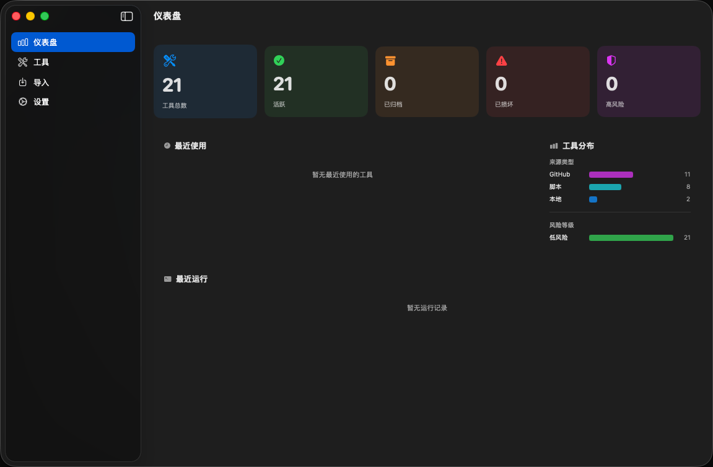
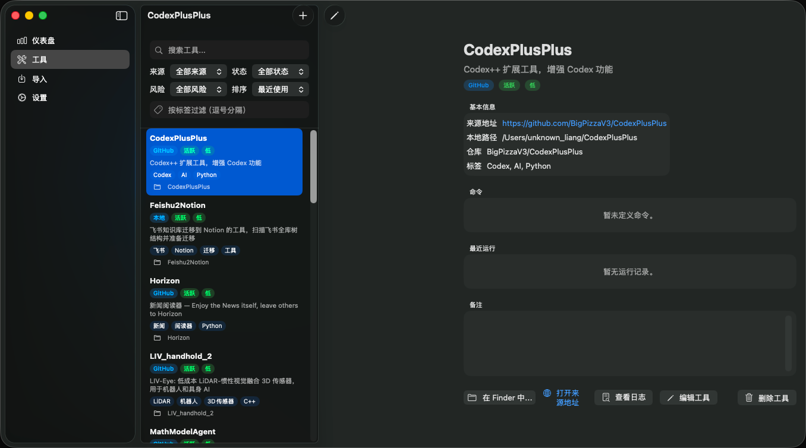
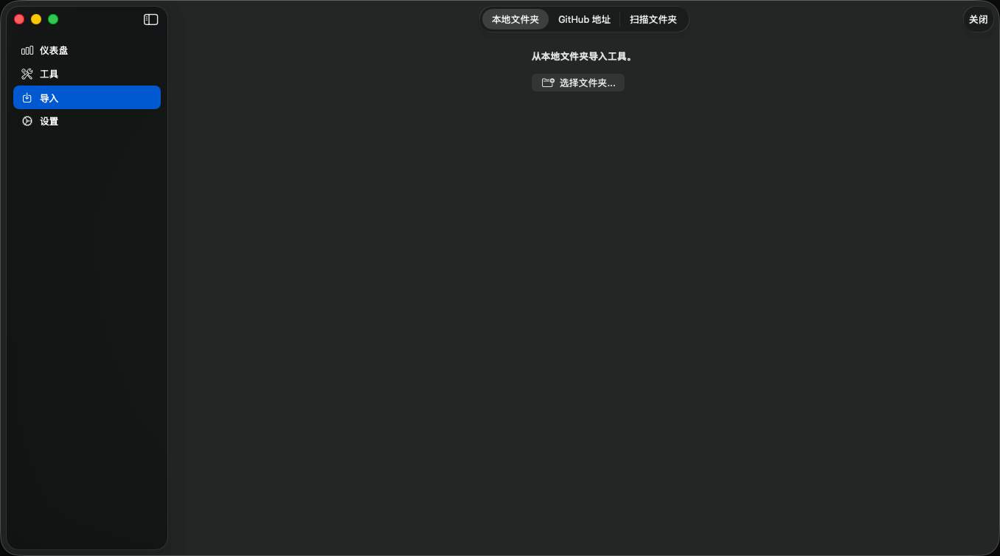

# ToolKeeper

> 一个原生 macOS 工具箱管理器，用来整理你从 GitHub、Homebrew、npm、pip、本地文件夹等各处收集来的脚本和工具。


[](https://github.com/UnknownJackMe/ToolKeeper/releases/latest)

---

## 安装

### 方式一：直接下载（推荐）

[](https://github.com/UnknownJackMe/ToolKeeper/releases/latest/download/ToolKeeper-1.0.0.dmg)

1. 下载 `ToolKeeper-1.0.0.dmg`
2. 打开 DMG，将 **ToolKeeper.app** 拖入 **Applications** 文件夹
3. 首次启动：右键点击 app → **打开**（绕过 Gatekeeper 未签名提示）

不需要安装任何依赖，开箱即用。

### 方式二：从源码构建

适合想 Fork 后自行修改的开发者。

**前置依赖**

```bash
# 安装 Tuist（项目生成工具）
brew install tuist
```

**克隆 & 运行**

```bash
git clone https://github.com/UnknownJackMe/ToolKeeper.git
cd ToolKeeper

# 安装 Swift Package Manager 依赖并生成 Xcode workspace
tuist install
tuist generate

# 在 Xcode 中打开，选择 ToolKeeper scheme，按 ⌘R 运行
open ToolKeeper.xcworkspace
```

**命令行构建**

```bash
tuist install && tuist generate

xcodebuild \
  -workspace ToolKeeper.xcworkspace \
  -scheme ToolKeeper \
  -configuration Release \
  -destination "platform=macOS,arch=arm64" \
  build
```

构建产物位于 `./DerivedData/Build/Products/Release/ToolKeeper.app`。

---

## 截图







---

## 功能

- **仪表盘** — 工具数量概览、来源/风险分布图、最近使用、最近运行记录
- **工具列表** — 按名称、状态、来源、风险等级、标签搜索和过滤，支持多种排序
- **工具详情** — 查看来源地址、本地路径、命令列表、运行历史、备注
- **命令执行** — 直接在应用内运行命令，实时显示 stdout/stderr，支持超时设置
- **风险拦截** — 自动识别高风险命令（`rm -rf`、`sudo`、`curl | sh` 等），执行前弹出确认
- **导入向导**：
  - 本地文件夹：自动解析 git 来源、README、npm scripts、Makefile、pyproject.toml
  - GitHub URL：输入仓库地址自动填充信息，可选克隆到本地
  - 批量扫描：递归扫描目录，一次性批量导入多个工具
- **隐私保护** — 自动脱敏 GitHub Token、OpenAI Key、AWS Key、Slack Token 等敏感信息
- **纯本地** — 无网络请求、无遥测、无账号，所有数据存在本地

---

## 系统要求

| 项目 | 版本 |
|------|------|
| macOS | 14.0 (Sonoma) 及以上 |
| Xcode | 15 及以上 |
| Tuist | 4.x |

---

## 项目结构

```
ToolKeeper/
├── Project.swift                    # Tuist 项目配置
├── Tuist.swift                      # Tuist 全局配置
├── Tuist/
│   └── ProjectDescriptionHelpers/
├── ToolKeeper/
│   ├── ToolKeeperApp.swift          # 入口、侧边栏导航、菜单栏
│   ├── ToolKeeper.entitlements      # 沙盒关闭（执行本地命令所需）
│   ├── Assets.xcassets/             # 应用图标及资源
│   ├── Models/
│   │   ├── Tool.swift               # 工具实体（SwiftData）
│   │   ├── ToolCommand.swift        # 命令实体（SwiftData）
│   │   ├── RunHistory.swift         # 运行历史实体（SwiftData）
│   │   └── AppSettings.swift        # 应用设置（JSON 持久化）
│   ├── Views/
│   │   ├── DashboardView.swift      # 仪表盘
│   │   ├── ToolsListView.swift      # 工具列表（搜索 + 过滤）
│   │   ├── ToolDetailView.swift     # 工具详情 + 命令执行
│   │   ├── ToolEditorView.swift     # 新建/编辑工具
│   │   ├── CommandEditorView.swift  # 新建/编辑命令
│   │   ├── ImportWizardView.swift   # 导入向导
│   │   ├── RunConsoleView.swift     # 实时命令输出控制台
│   │   └── SettingsView.swift       # 设置
│   ├── ViewModels/
│   │   ├── ToolsViewModel.swift
│   │   ├── ToolDetailViewModel.swift
│   │   └── ImportViewModel.swift
│   └── Services/
│       ├── CommandRunner.swift      # 子进程执行 + 实时输出
│       ├── RiskClassifier.swift     # 命令风险级别判断
│       ├── Sanitizer.swift          # 敏感信息脱敏
│       ├── GitParser.swift          # 解析 git config / GitHub URL
│       ├── ImportAnalyzer.swift     # 分析文件夹（README、package.json 等）
│       ├── FolderScanner.swift      # 递归扫描
│       ├── LogStore.swift           # 日志文件管理
│       └── AppPaths.swift           # 数据目录路径
└── ToolKeeperTests/
    ├── RiskClassifierTests.swift
    ├── SanitizerTests.swift
    ├── GitParserTests.swift
    └── ImportAnalyzerTests.swift
```

---

## 数据存储位置

| 内容 | 路径 |
|------|------|
| 数据库 | `~/Library/Application Support/ToolKeeper/ToolKeeper.store` |
| 设置 | `~/Library/Application Support/ToolKeeper/settings.json` |
| 命令日志 | `~/Library/Application Support/ToolKeeper/Logs/` |

---

## 安全设计

**为什么关闭沙盒？**  
应用需要通过 `/bin/zsh` 执行用户定义的本地命令，macOS 沙盒会阻止这类操作。关闭沙盒是有意为之的设计取舍，已在 `ToolKeeper.entitlements` 中说明。

**其他安全措施：**
- 导入的脚本绝不会自动执行，命令只在用户主动点击「运行」时才执行
- 高风险命令（含 `rm -rf`、`sudo`、`curl | sh` 等）在执行前强制弹出二次确认
- 自动脱敏：GitHub Token (`ghp_`)、OpenAI Key (`sk-`)、AWS Key (`AKIA`)、Slack Token 等在写入存储前会被替换为占位符
- 无任何网络请求、无遥测、无分析代码

---

## 运行测试

```bash
xcodebuild test \
  -workspace ToolKeeper.xcworkspace \
  -scheme ToolKeeper \
  -destination "platform=macOS,arch=arm64"
```

---

## 常见问题

**`tuist generate` 报错**  
确保安装的是 Tuist 4.x：`tuist version`，然后先运行 `tuist install`。

**构建时提示沙盒相关错误**  
确认 `ToolKeeper.entitlements` 中 `com.apple.security.app-sandbox` 为 `false`。

**命令运行没有输出**  
检查命令的工作目录是否存在，以及命令是否需要交互式输入（当前不支持）。可在 `~/Library/Application Support/ToolKeeper/Logs/` 查看完整日志。

**SwiftData 数据库迁移失败**  
删除旧数据库后重新启动：
```bash
rm -rf ~/Library/Application\ Support/ToolKeeper/ToolKeeper.store
```

---

## 路线图

- [ ] 菜单栏快速访问最近工具
- [ ] 拖拽导入工具文件夹
- [ ] 工具数据导出/导入（JSON）
- [ ] 命令模板库
- [ ] 工具健康检查（检测本地路径是否存在）
- [ ] Spotlight 集成

---

## 贡献

欢迎提 Issue 和 PR。提交 PR 前请先运行测试确保通过。

---

## License

MIT License. See [LICENSE](LICENSE) for details.
